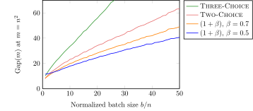
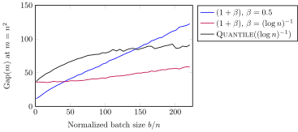
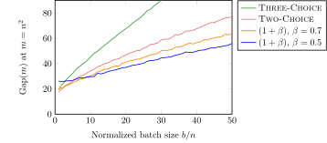
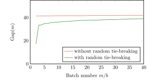

# Code for the  paper "Balanced Allocations in Batches: Simplified and Generalized"

This repository contains the relatively simple C++ code for reproducing the experiments for the ${b\text{-}{\rm B{\small ATCHED}}}$ setting studied in the paper "Balanced Allocations in Batches: Simplified and Generalized" which appeared in the SPAA 2022 conference ([arxiv version](https://arxiv.org/abs/2203.13902), [slides](https://www.cl.cam.ac.uk/~dl516/slides/spaa22_slides.pdf), [visualisations](https://dimitrioslos.com/spaa22)).

The code produces the data points for the following four figures (see ``figs/raw.out`` for raw outputs):

* Average gap for ${{\rm T{\small HREE}\text{-}C{\small HOICE}}}$, ${{\rm T{\small WO}\text{-}C{\small HOICE}}}$, $(1+\beta)$-process with $\beta = 0.7$ and $\beta = 0.5$, for the $b$-Batched setting with unit weights and with $b \in \{ n, 2n , \ldots , 50n \}$ for $n = 10^3$ and $m = n^2$ (averaged over $100$ runs).

<p align="center">

</p>

* Average gap for $(1+\beta)$ with $\beta = 0.5$ and $\beta = (\log n)^{-1}$ and ${{\rm Q{\small UANTILE}}}( (\log n)^{-1})$ for the ${b\text{-}{\rm B{\small ATCHED}}}$ setting with unit weights for $b \in \{ n, 2n , \ldots , 220n \}$, $n = 10^3$ and $m = n^2$ (over $100$ runs).

<p align="center">

</p>

* Average gap for the ${b\text{-}{\rm B{\small ATCHED}}}$ setting \textit{with weights} sampled from an $\mathsf{Exp}(1)$ distribution. Further, $b \in \{ n, 2n , \ldots , 50n \}$, $n=10^3$ and $m=n^2$ (over $100$ runs).

<p align="center">

</p>

* Average gap for the ${{\rm T{\small WO}\text{-}C{\small HOICE}}}$ process *with* and *without* random tie-breaking in the ${b\text{-}{\rm B{\small ATCHED}}}$ setting with unit weights, for $b = 25\cdot n$, $n = 10^3$ (over $100$ runs).

<p align="center">

</p>


## Build instructions

The entire code is a single C++ file (using the C++17 standard), so it can be run using 
```
g++ src/batched_spaa_22.cc && ./a.out
```
(or any other compiler). 

In the `/src` directory there is also a `CMakeLists.txt` file if you want to use `cmake`.

## Contact us

If you are having any trouble running the code or have any other inquiry, don't hesitate to contact us! You can either open an issue or send us an email (see [paper](https://arxiv.org/abs/2203.13902) for email addresses).
